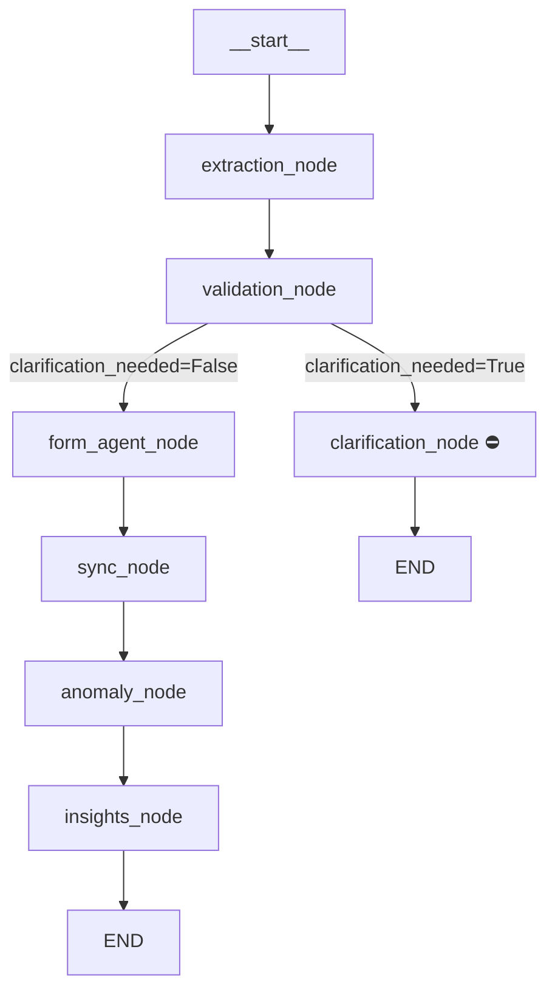

# Pipeline: LangGraph Orchestrator

## File Map
- Graph builder: [pipeline.py](../nirvaah-backend/app/pipeline.py)
- Shared state: [state.py](../nirvaah-backend/app/state.py)
- Tests: [test_pipeline.py](../nirvaah-backend/tests/test_pipeline.py)

## Purpose
Wires all agent nodes into a LangGraph directed graph, compiles it once at startup, and exposes `run_pipeline()` as the single entry point for webhook.py.

## Graph Structure

## Node Status
| Node | Agent | Status |
|---|---|---|
| `extraction_node` | Agent 1 | ✅ Implemented |
| `validation_node` | Agent 2 | ✅ Implemented |
| `clarification_node` | — | ⚠️ Stub (prints question) |
| `form_agent_node` | Agent 3 | ⚠️ Stub |
| `sync_node` | Agent 4 | ⚠️ Stub |
| `anomaly_node` | Agent 5 | ⚠️ Stub |
| `insights_node` | Agent 6 | ⚠️ Stub |

## Public API

### `run_pipeline(sender_phone, audio_bytes, text, image_bytes) -> dict`
Main entry point called by webhook.py. Routes input through `process_input()`, builds initial state, runs the LangGraph graph, returns final state dict.

### `build_pipeline() -> CompiledGraph`
Builds and compiles the LangGraph state graph. Called once at module load time; the compiled graph (`pipeline_graph`) is reused for every request.

### `route_after_validation(state) -> str`
Conditional edge function. Returns `"clarification_node"` or `"form_agent_node"` based on `state["clarification_needed"]`.

## PipelineState Keys

| Key | Type | Set By |
|---|---|---|
| `transcript` | str | webhook / process_input |
| `sender_phone` | str | webhook |
| `input_source` | str | process_input |
| `extracted_fields` | dict | extraction_node |
| `validated_fields` | dict | validation_node |
| `clarification_needed` | bool | extraction / validation |
| `clarification_question` | str | extraction / validation |
| `validation_alerts` | list | validation_node |
| `mapped_forms` | dict | form_agent_node |
| `sync_status` | dict | sync_node |
| `anomaly_score` | float | anomaly_node |
| `anomaly_flags` | list | anomaly_node |
| `dropout_risk` | float | insights_node |
| `eligible_schemes` | list | insights_node |
| `risk_summary` | str | insights_node |
| `errors` | list | all nodes |
| `pipeline_complete` | bool | insights_node |
